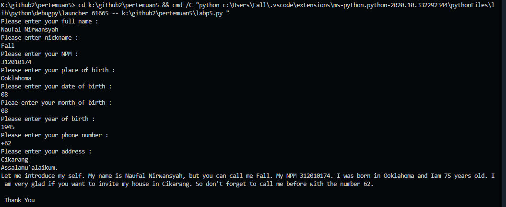
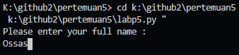
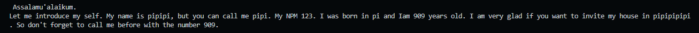
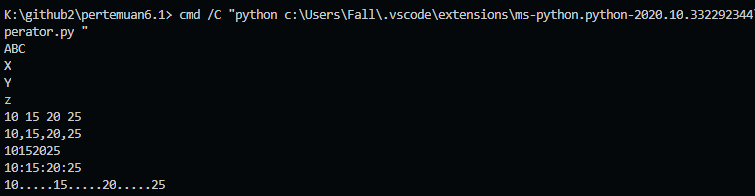
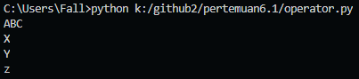
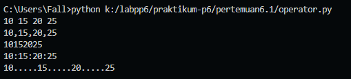
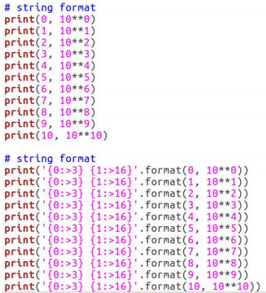
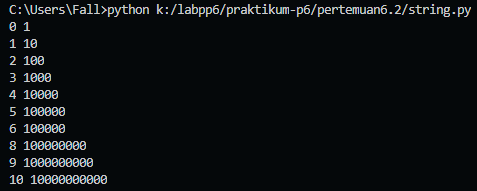

# Tugas Pertemuan ke-6 [Senin, 26-10-2020]

<pre>
Nama  : NAUFAL NIRWANSYAH
Kelas : TI.20.A1
NIM   : 312010174
</pre>

<br>
<br>

<p align="center">
  
Daftar isi tugas sebelumnya<br>
| No. | Keterangan | Link |
| --- | --- | --- |
| 1 | Pertemuan 5 | [Link](#tugas-pertemuan-5) |
| 2 | Pertemuan 6-1 | [Link](#tugas-pertemuan-6-1) |
| 3 | Pertemuan 6-2 | [Link](#tugas-pertemuan-6-2) |
| 4 | Pertemuan | [Link](https://...) |
| 5 | Pertemuan | [Link](https://...) |

</p>

<br>

## Tugas Pertemuan 5
Berikut adalah tugas pada pertemuan ke - 5 = **Biodata**
<br>

```print("Please enter your full name : ")
fullname=input()
print("Please enter nickname : ")
nickname=input()
print("Please enter your NPM : ")
npm=int(input())
print("Please enter your place of birth : ")
pob=input()
print("Please enter your date of birth : ")
date=int(input())
print("Pleae enter your month of birth : ")
month=input()
print("Please enter year of birth : ")
year=int(input())
print("Please enter your phone number : ")
phone=int(input())
print("Please enter your address : ")
address=input()

dob=2020-year

print("Assalamu'alaikum. ")
print(f"Let me introduce my self. My name is {fullname}, but you can call me {nickname}. My NPM {npm}. I was born in {pob} and Iam {dob} years old. I am very glad if you want to invite my house in {address}. So don't forget to call me before with the number {phone}. \n\n Thank You ")

```
<br>

**Maka akan keluar ouput sebagai berikut :**



<br>
Berikut Penjelasannya :


***print("please enter your full name : ")***

Source code diatas berfungsi untuk mencetak hasil / output berupa **Please enter your full name** : ".

Untuk menampilkan output string, saya menggunakan tanda petik dua didalam fungsi print(),
sedangkan jika saya ingin menampilkan output atau hasil berupa angka atau interger saya tidak perlu menggunakan tanda petik dua. Contohnya : <br>

***print("Nama saya adalah...")***
<br>***print(1234567)***



Keterangan : <br> 
>Variable adalah sebuah wadah penyimpanan data pada program yang akan akan digunakan selama program itu berjalan. yang berfungsi sebagai variable dalam source code diatas adalah **fullname** . <br>
>Fungsi **input()** adalah untuk memasukan nilai dari layar console di command prompt, lalu kemudian mengembalikan nilai saat kita menekan tombol enter *(newline)*<br> 
 *(newline)*<br>

 * Untuk menghitung rumus saya menggunakan variable *DOB* yaitu 2020 (Tahun sekarang) dikurangin dengan Year of Birt, pada source code berikut :<br>
``` python
dob=2020-year
```
<br> Pada syntax/source diatas, saya menggunakan variable (dob) dimana untuk menghitung umur (variable **age** pada output), yaitu dengan rumus pada variable *dob=2020-year*
<br>

* langkah kali ini saya akan menampilkan output yang diminta oleh dosen.<br>
output pertama yang diminta Dosen adalah menampilkan salam, yaitu dengan mengetikkan syntax/source code berikut :
``` python
print("\n\n Assalamu'alaikum. ")

Keterangan :
1. Fungsi **\n** pada source code di atas adalah untuk memberi baris baru / enter / *(newline)*
2. Fungsi print() seperti dijelaskan pada point **Output** diatas.
Hasil dari source code diatas adalah seperti gambar dibawah ini :
```
 <br>

Keterangan : 
1. Fungsi huruf **f** pada perintah *print(f"....")* adalah fungsi print atau bisa memudahkan programer dalam mencetak statement dalam satu baris dibandingkan dengan metode yang lama yaitu memisahkan string dan variable dengan simbol koma( , ) atau plus ( + )<br>
2. Sedangkan fungsi {} pada output tersebut adalah untuk menampilkan hasil dari variable<br>


## Tugas Pertemuan 6-1

Berikut adalah tugas pada pertemuan ke - 6 = **Operator**
<br>

```#penggunaan end
print('A', end='')
print('B', end='')
print('C', end='')
print()
print('X')
print('Y')
print('z')

#penggunaan separator
w, x, y, z = 10, 15, 20, 25
print(w, x, y, z)
print(w, x, y, z, sep=',')
print(w, x, y, z, sep='')
print(w, x, y, z, sep=':')
print(w, x, y, z, sep='.....')
```
<br>

***Maka akan terlampir input seperti ini***
 <br>

-   Penggunaan END
Penggunaan end digunakan untuk menambahkan karakter yang dicetak di akhir baris. secara default penggunaan end adalah untuk ganti baris.  
``` python
print('A', end='')
print('B', end='')
print('C', end='')
```
> Penggunaan print () digunakan untuk mencetak output, seperti syntax dibawah ini :

``` python
print()
```
>Syntax dibawah ini digunakan untuk menampilkan output berupa string
``` python
print('X')
print('Y')
print('z')
```
Hasil dari source code tersebut seperti gambar dibawah ini:
<br>



* Penggunaan separator

>Pendeklarasian beberapa variable beserta nilainya
``` python
w,x,y,z=10,15,20,25
```

>Menampilkan hasil dari variable tiap-tiap variable
``` python
print(w,x,y,z)
```

>Menampilkan hasil dari tiap-tiap variable dengan menggunakan pemisah : (koma)
``` python
print(w,x,y,z,sep=",")
```
>Menampilkan hasil dari tiap-tiap variable dengan menggunakan pemisah
``` python
print(w,x,y,z,sep="")
```

>Menampilkan hasil dari tiap-tiap variable dengan menggunakan pemisah : (titik dua)
``` python
print(w,x,y,z,sep=":")
```

>Menampilkan hasil dari tiap-tiap variable dengan menggunakan pemisah -----
``` python
print(w,x,y,z,sep="-----")
```

hasil dari syntax / source code diatas adalah seperti berikut ini : <br>

<br>
<br>


## Tugas Pertemuan 6-2
<br>

Berikut adalah tugas pada pertemuan ke - 6 = **String Format**

- **String Format** <br>
String formatting atau pemformatan string memungkinan kita menyuntikkan item kedalam string dari pada kita mencoba menggabungkan string menggunakan koma atau string concatenation.<br>

Menggunakan souce code yang diberikan oleh dosen pengampu pada pertemmuan ini :


```
#string format 1
print(0, 10**0)
print(1, 10**1)
print(2, 10**2)
print(3, 10**3)
print(4, 10**4)
print(5, 10**5)
print(6, 10**5)
print(8, 10**8)
print(9, 10**9)
print(10, 10**10)

#string format 2
print('{0:>3} {1:>16}'.format(0, 10**0))
print('{0:>3} {1:>16}'.format(1, 10**1))
print('{0:>3} {1:>16}'.format(2, 10**2))
print('{0:>3} {1:>16}'.format(3, 10**3))
print('{0:>3} {1:>16}'.format(4, 10**4))
print('{0:>3} {1:>16}'.format(5, 10**5))
print('{0:>3} {1:>16}'.format(6, 10**6))
print('{0:>3} {1:>16}'.format(7, 10**7))
print('{0:>3} {1:>16}'.format(8, 10**8))
print('{0:>3} {1:>16}'.format(9, 10**9))
print('{0:>3} {1:>16}'.format(10, 10**10))
```

Mari kita bahas syntax yang telah diberikan.
<br>

1. **String Format 1** <br>
Pada syntax string format 1 akan menampilkan hasil berupa 2 output. <br>
Yang pertama dari sebelah kiri akan menampilkan urutan angka dari 0 - 10, sedangkan dari sebelah kanan akan menampilkan *Operasi Aritmatika Pangkat*. <br>
Dengan ketentuan sebagai berikut, Operasi pangkat dengan angka kiri sebagai pokok. <br>
(Rumus : ** [bintang dua] ) <br>
Berikut sample output dari syntax diatas : <br>

